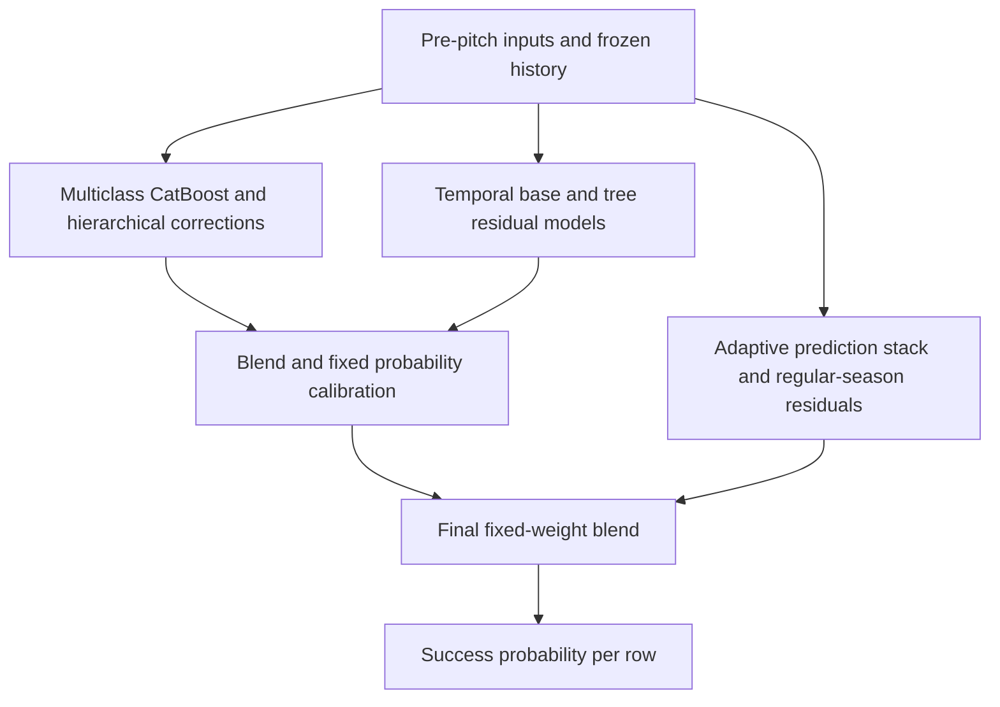

# Baseball Pitch Control Prediction

**LG Aimers · Tabular machine learning · Probability estimation**

Predict the probability that a baseball pitch achieves its intended control outcome using information available **before the pitch**. This team project progressed from tree-based baselines to multiclass CatBoost, hierarchical residual corrections, probability calibration, and a final ensemble of complementary prediction pipelines.

The focus of this repository is the development process: how features, model objectives, validation, and ensemble design evolved through the final submission.

[Methodology](docs/METHODOLOGY.md) · [Development journey](docs/DEVELOPMENT.md) · [Experiment guide](exp/README.md) · [Data guide](docs/DATA.md)

## Project at a glance

| Item | Description |
| --- | --- |
| Task | Binary probability prediction: `P(control_success = 1)` |
| Training data | 1,475,092 pitches from 2019–2024; 48 input columns and one target |
| Core model | Eight-seed, five-class CatBoost with contextual, current-season, and pitch-mix features |
| Later extensions | Team categorical encoding, hierarchical shrinkage, residual learning, and low-rank interaction effects |
| Final approach | Blend a calibrated CatBoost/temporal-residual pipeline with an adaptive prediction stack enhanced by a regular-season residual ensemble |
| Evaluation | Brier-based competition score; chronological backtests and comparisons using the same random seeds |
| Delivery | Frozen model artifacts, shared feature transformations, and row-independent inference |
| Stack | Python, NumPy, pandas, scikit-learn, CatBoost, LightGBM, joblib; additional XGBoost and neural-network investigations |

## Methodology

### 1. Establish a baseline and investigate distribution shift

Start with the organizer's Random Forest baseline and histogram-based gradient boosting. Examine class balance, player history, missing values, and changes across seasons. Use earlier seasons for training and a later season for validation; the multi-year harness evaluates 2021, 2022, 2023, and 2024 separately.

### 2. Engineer features from pre-pitch information

- **Game context:** ball–strike count, full-count indicators, handedness matchups, and runners in scoring position.
- **History reliability:** log sample counts, smoothed pitcher/batter success rates, and missing-history indicators.
- **Recent form:** differences between recent-game rates and career rates.
- **Season progress:** subtract fixed historical totals from each row's supplied cumulative statistics to estimate current-season performance; shrink estimates with little history.
- **Pitch mix:** historical pitcher-by-count tendencies and a separate model's estimated fastball probability. The actual pitch type is not an inference input.

### 3. Learn the underlying outcome types

A single failure label combines different outcomes. The selected model learns five mutually exclusive classes: **success, middle-location failure, reverse-direction failure, both failure indicators, and other failure**. Auxiliary training labels are reconstructed from consecutive cumulative statistics within the training data. At inference, only the probability of the success class is returned.

The resulting success probability became the core of the later pipeline. Team IDs were subsequently treated as native categorical features to capture team-level differences. See [label construction and its limits](docs/METHODOLOGY.md#multiclass-target-construction).

### 4. Add structured residual corrections

Extend the multiclass model with frozen, hierarchical corrections for pitcher, batter handedness, and count pressure. Shrink sparse groups toward broader groups so that limited history does not produce unstable adjustments.

A complementary temporal pipeline combines smoothed pitcher/batter season estimates with LightGBM and histogram-gradient-boosting residual models, team effects, and low-rank interaction corrections. We implemented and evaluated this branch alongside the multiclass model to test whether the two approaches captured complementary information.

### 5. Calibrate and combine complementary models

Apply fixed probability shifts and scaling to address systematic bias. Study prediction differences and the quadratic structure of Brier loss to choose blend weights, rather than assuming that adding another model will help.

We integrated the calibrated pipeline with an adaptive prediction stack and an ensemble of CatBoost residual regressors applied to regular-season rows. We then selected the blend coefficients and correction strengths and froze them before inference. The [development journey](docs/DEVELOPMENT.md) explains the implementation and integration work behind this final configuration.

### 6. Validate changes and package independent inference

Average eight CatBoost models trained with different seeds. Compare feature groups, training depth, learning schedules, and ensemble weights through controlled experiments. Separate improvements in the shape of predictions from improvements caused by their overall mean moving closer to the observed success rate.

Local improvements did not always transfer to a later season. Controlled ablations, forward-year checks, and unsuccessful experiments informed which changes were retained.

Training and inference share feature functions. The model bundle contains the fitted models, feature order, priors, and historical lookup tables. Each test row is transformed using its own inputs and those fixed artifacts, so predictions do not require aggregating or ordering the test batch.



## Run the included checkpoint

The commands below run the preserved `submit14` multiclass model, an earlier reproducible checkpoint. The final development pipeline is documented above and in the methodology; its complete collection of later model artifacts is not included in this checkout.

Use **Python 3.11** for the supplied model environment. Obtain the competition data separately and place `test.csv` and, optionally, `sample_submission.csv` in `data/`. The distributed five-row test file demonstrates the schema; it is not the hidden evaluation set.

```bash
git clone https://github.com/this-acorn/LGAimers.git
cd LGAimers
python -m venv .venv
```

Activate the environment:

```bash
# macOS / Linux
source .venv/bin/activate
```

```powershell
# Windows PowerShell
.venv\Scripts\Activate.ps1
```

Then install the selected submission's dependencies and run:

```bash
python -m pip install -r submissions/submit14_src/requirements.txt
python tools/run_inference.py --data-dir data --output output/submission.csv
```

The runner stages the existing inference package in a temporary working directory and produces `row_id,control_success` in the output CSV. The supplied model bundle is at `submissions/submit14_src/model/model.pkl`.

To build a competition-format ZIP:

```bash
python tools/build_submission.py --output output/submit14.zip
```

To retrain the selected model, place `train.csv` and the sample `test.csv` in `data/`, then run from the repository root:

```bash
python -X utf8 exp/54_train_mc79.py
```

Full training uses eight models, is substantially slower than inference, and replaces the selected model bundle. The [experiment guide](exp/README.md) lists validation scripts and historical dependencies. Original experiment-specific packaging scripts retain workstation-specific scratch paths; use `tools/` for portable inference and packaging.

## Repository structure

```text
LGAimers/
├── README.md
├── docs/                  # English methodology, results, and data guide
│   └── archive/           # Original research notes and handoff history
├── exp/                   # Numbered experiments and shared utilities
├── submissions/           # Inference sources and fitted model bundles
│   ├── baseline_submit/   # Organizer-provided baseline
│   └── submit14_src/      # Reproducible multiclass CatBoost checkpoint
├── tools/                 # Portable inference and ZIP-building commands
├── lab/                   # Experiment reports and recorded predictions
│   └── deep_learning/     # MLP experiment reports
├── artifacts/submissions/ # Historical submission and collaboration ZIPs
└── archive/runners/       # Original local automation scripts
```

Competition data and local environments are kept outside the versioned source. Ignore rules are maintained locally rather than distributed in this repository. Historical artifacts already tracked in the repository are preserved. See the [path migration map](docs/REPOSITORY_MAP.md).

## Project scope

The team worked on feature engineering, multiclass modeling, chronological experiments, residual correction, probability calibration, model integration, and inference packaging. The documentation covers the methodology through the final local package; the runnable example uses the earlier checkpoint included here. See the [implementation map](docs/DEVELOPMENT.md#implementation-map) for component details.
