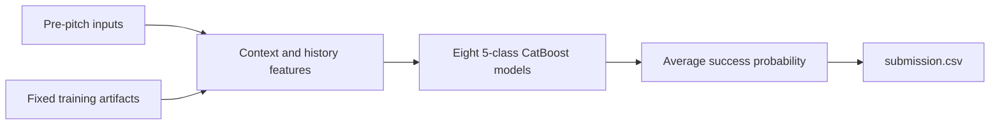

# Baseball Pitch Control Prediction

**LG Aimers · Tabular machine learning · Probability estimation**

Predict the probability that a baseball pitch achieves its intended control outcome using information available **before the pitch**. This team project develops a CatBoost ensemble through feature engineering, chronological validation, and analysis of why individual pitches fail.

The documented multiclass submission scored **1,033.99** on the public leaderboard, compared with **549.51** for the organizer's Random Forest baseline. These are historical results for the submission versions included here, not a claim about the team's final competition score or rank.

[Methodology](docs/METHODOLOGY.md) · [Results and lessons](docs/RESULTS.md) · [Experiment guide](exp/README.md) · [Data guide](docs/DATA.md)

## Project at a glance

| Item | Description |
| --- | --- |
| Task | Binary probability prediction: `P(control_success = 1)` |
| Training data | 1,475,092 pitches from 2019–2024; 48 input columns and one target |
| Selected model | Eight CatBoost classifiers trained on five outcome classes; average the success-class probabilities |
| Features | 79 inputs: 47 supplied predictors + 18 contextual features + 11 season-progress features + 3 pitch-mix features |
| Evaluation | Brier-based competition score; chronological backtests and comparisons using the same random seeds |
| Delivery | Standalone inference script, serialized model bundle, and pinned dependencies |
| Stack | Python, NumPy, pandas, scikit-learn, CatBoost, joblib; exploratory LightGBM, XGBoost, and neural-network experiments |

## Methodology

### 1. Establish a baseline and investigate distribution shift

Start with the organizer's Random Forest baseline and histogram-based gradient boosting. Examine class balance, player history, missing values, and changes across seasons. Use earlier seasons for training and a later season for validation; the multi-year harness evaluates 2021, 2022, 2023, and 2024 separately.

### 2. Engineer features from pre-pitch information

- **Game context:** ball–strike count, full-count indicators, handedness matchups, and runners in scoring position.
- **History reliability:** log sample counts, smoothed pitcher/batter success rates, and missing-history indicators.
- **Recent form:** differences between recent-game rates and career rates.
- **Season progress:** subtract fixed historical totals from each row's supplied cumulative statistics to estimate current-season performance; shrink estimates with little history.
- **Pitch mix:** historical pitcher-by-count tendencies and a separate model's estimated fastball probability. The actual pitch type is not an inference input.

### 3. Learn the underlying outcome types

A single failure label combines different outcomes. The selected model learns five mutually exclusive classes: **success, middle-location failure, reverse-direction failure, both failure indicators, and other failure**. Auxiliary training labels are reconstructed from consecutive cumulative statistics within the training data. At inference, only the probability of the success class is returned.

This change increased the recorded public score from **993.63 to 1,033.99** with the same 79-feature family. See [label construction and its limits](docs/METHODOLOGY.md#multiclass-target-construction).

### 4. Reduce variance and test changes systematically

Average eight CatBoost models trained with different seeds. Compare feature groups, training depth, learning schedules, and ensemble weights through controlled experiments. Separate improvements in the shape of predictions from improvements caused by their overall mean moving closer to the observed success rate.

Local gains did not always transfer to the leaderboard. The repository records rejected feature and neural-network experiments as well as successful changes; [the results discussion](docs/RESULTS.md) explains these limitations.

### 5. Package inference that works on independent rows

Training and inference share feature functions. The model bundle contains the fitted models, feature order, priors, and historical lookup tables. Each test row is transformed using its own inputs and those fixed artifacts, so predictions do not require aggregating or ordering the test batch.



## Recorded results

| Submission | Main change | Public score |
| --- | --- | ---: |
| Organizer baseline | Random Forest | 549.51 |
| `submit4` | 65-feature histogram gradient boosting | 830.32 |
| `submit8` | Eight-seed CatBoost ensemble | 898.62 |
| `submit10` | Add season-progress features | 990.96 |
| `submit12` | Add pitch-mix features | 993.63 |
| **`submit14`** | **Five-class target decomposition** | **1,033.99** |

Higher is better. Values are rounded historical public-leaderboard observations from the [project log](docs/archive/HANDOFF.md), not classification accuracy. Local validation scores use different seasons and should not be compared directly with public scores. [Metric definition and evidence](docs/RESULTS.md).

## Run inference

Use **Python 3.11** for the supplied model environment. Obtain the competition data separately and place `test.csv` and, optionally, `sample_submission.csv` in `data/`. The distributed five-row test file demonstrates the schema; it is not the hidden evaluation set.

```bash
git clone https://github.com/this-acorn/LGAimers.git
cd LGAimers
python -m venv .venv
```

Activate the environment:

```bash
# macOS / Linux
source .venv/bin/activate
```

```powershell
# Windows PowerShell
.venv\Scripts\Activate.ps1
```

Then install the selected submission's dependencies and run:

```bash
python -m pip install -r submissions/submit14_src/requirements.txt
python tools/run_inference.py --data-dir data --output output/submission.csv
```

The runner stages the existing inference package in a temporary working directory and produces `row_id,control_success` in the output CSV. The supplied model bundle is at `submissions/submit14_src/model/model.pkl`.

To build a competition-format ZIP:

```bash
python tools/build_submission.py --output output/submit14.zip
```

To retrain the selected model, place `train.csv` and the sample `test.csv` in `data/`, then run from the repository root:

```bash
python -X utf8 exp/54_train_mc79.py
```

Full training uses eight models, is substantially slower than inference, and replaces the selected model bundle. The [experiment guide](exp/README.md) lists validation scripts and historical dependencies. Original experiment-specific packaging scripts retain workstation-specific scratch paths; use `tools/` for portable inference and packaging.

## Repository structure

```text
LGAimers/
├── README.md
├── docs/                  # English methodology, results, and data guide
│   └── archive/           # Original research notes and handoff history
├── exp/                   # Numbered experiments and shared utilities
├── submissions/           # Inference sources and fitted model bundles
│   ├── baseline_submit/   # Organizer-provided baseline
│   └── submit14_src/      # Selected multiclass CatBoost submission
├── tools/                 # Portable inference and ZIP-building commands
├── lab/                   # Experiment reports and recorded predictions
│   └── deep_learning/     # MLP experiment reports
├── artifacts/submissions/ # Historical submission and collaboration ZIPs
└── archive/runners/       # Original local automation scripts
```

Competition data, local environments, and newly generated outputs are ignored by Git. Historical artifacts already tracked in the repository are preserved. See the [path migration map](docs/REPOSITORY_MAP.md).

## Scope and attribution

This is a competition research repository and team project. The organizer supplied the baseline and data specification; the repository preserves those materials alongside the team's experiments. The English overview describes the code and results included in this snapshot. Original Korean research notes remain available for provenance, and exploratory methods are identified separately from the selected inference model.
